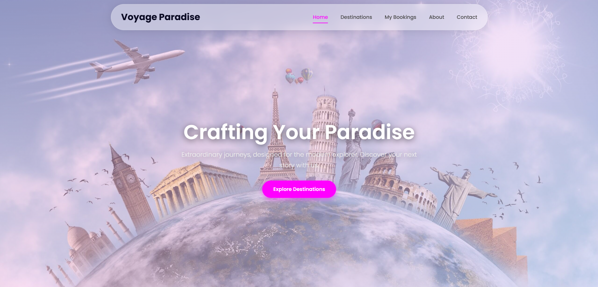
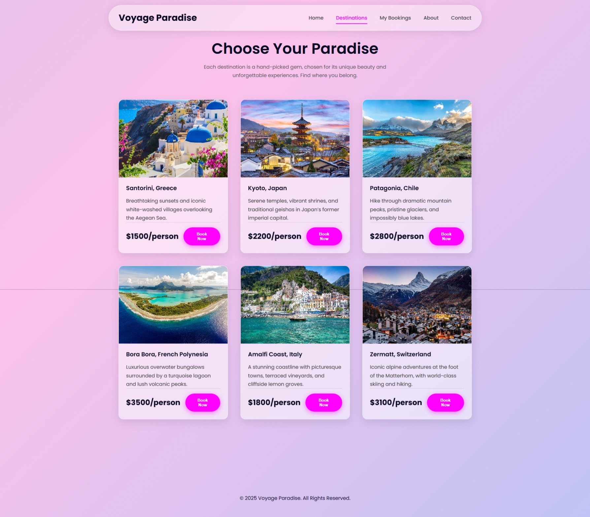
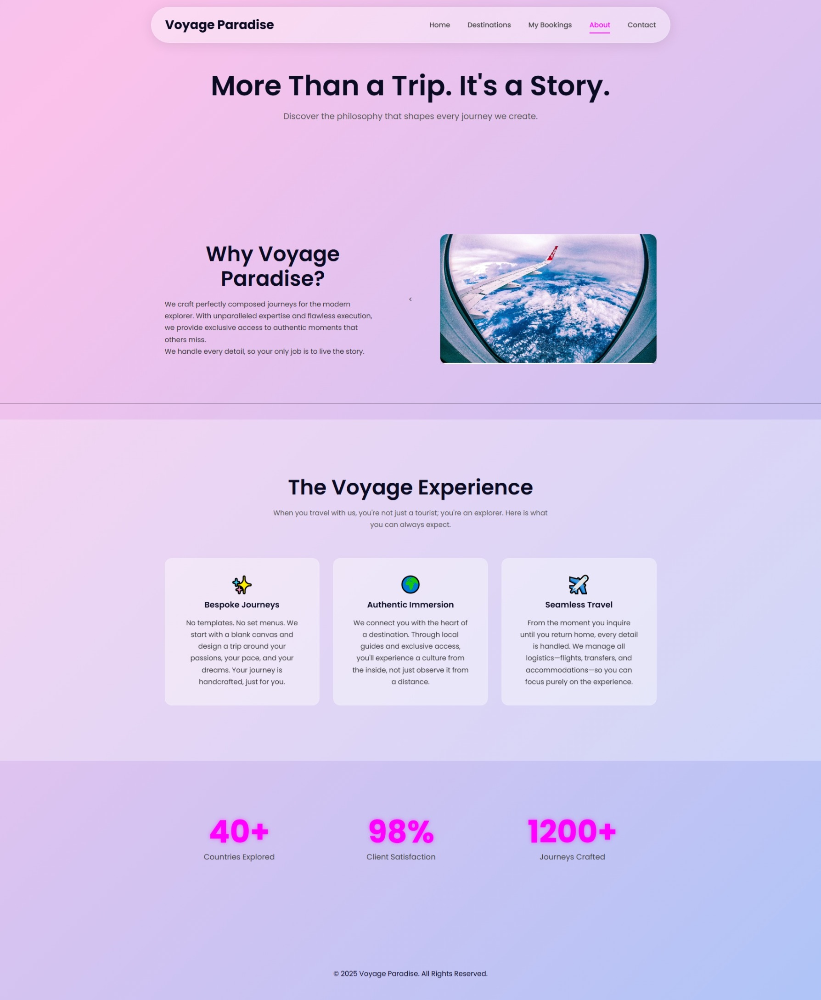
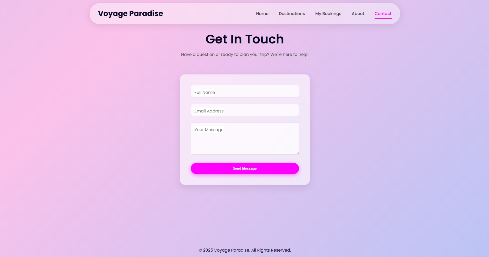

**Voyage Paradise** 🌴

**Voyage Paradise** is a modern, fully responsive travel agency website designed to provide a seamless user experience for Browse destinations and managing bookings. It features a unique, animated gradient and glassmorphism UI, built with a dynamic PHP backend and MySQL database.

This project demonstrates a full-stack application handling everything from frontend design and interactivity to backend API creation and database management.

✨ **Key Features**

  - **Sleek, Modern UI:** A unique, light, animated gradient theme with "glassmorphism" transparent elements for a premium feel.
  - **Fully Responsive:** The layout seamlessly adapts to all screen sizes, from mobile phones to desktops.
  - **Dynamic Content:** Destinations and bookings are fetched directly from a MySQL database.
  - **Interactive Booking System:** Users can book trips for any destination through an interactive modal.
  - **Booking Management:** A private "My Bookings" page displays all current bookings and features a "Cancel" button that removes the entry from the database in real-time.
  - **Functional Contact Form:** Submissions are validated and saved directly to the database.
  - **Secure Backend:** The PHP backend uses prepared statements to prevent SQL injection vulnerabilities.

-----

### 🛠️ Technologies Used

  - **Frontend:** HTML5, CSS3 (Flexbox, Grid, Animations), JavaScript (ES6+, Fetch API)
  - **Backend:** PHP
  - **Database:** MySQL

-----

### 🚀 How to Use (Local Setup)

To run this project locally, follow these steps:

1.  **Clone the repository:**

    ```bash
    git clone https://github.com/theikram/Travel-Agency.git
    ```

2.  **Set up your local server:**

      - Ensure you have a local server environment like **XAMPP** or **MAMP** running with Apache and MySQL services started.
      - Place the entire project folder into your server's root directory (e.g., `htdocs` for XAMPP).

3.  **Create and Populate the Database:**

      - Open **phpMyAdmin** from your server's control panel.
      - Create a new database and name it `travel_db`.
      - Select the new database and go to the **"Import"** tab.
      - Upload the `db.sql` file included in this project to create the tables and populate them with sample data.

4.  **Configure the Database Connection:**

      - Open the `/backend/config.php` file.
      - Make sure the database credentials (`$host`, `$user`, `$pass`, `$db`) match your local server setup. For a default XAMPP installation, this is usually:
        ```php
        $host = 'localhost';
        $user = 'root';
        $pass = '';
        $db   = 'travel_db';
        ```

5.  **Run the Project:**

      - Open your web browser and navigate to `http://localhost/your-project-folder-name`. The website should now be fully functional.
  
6. 📸 **Screenshots**

Here are a few glimpses of Voyage Paradise in action.

**Homepage**


**Destinations Page**


**About Us Page**


**Contact Form**

